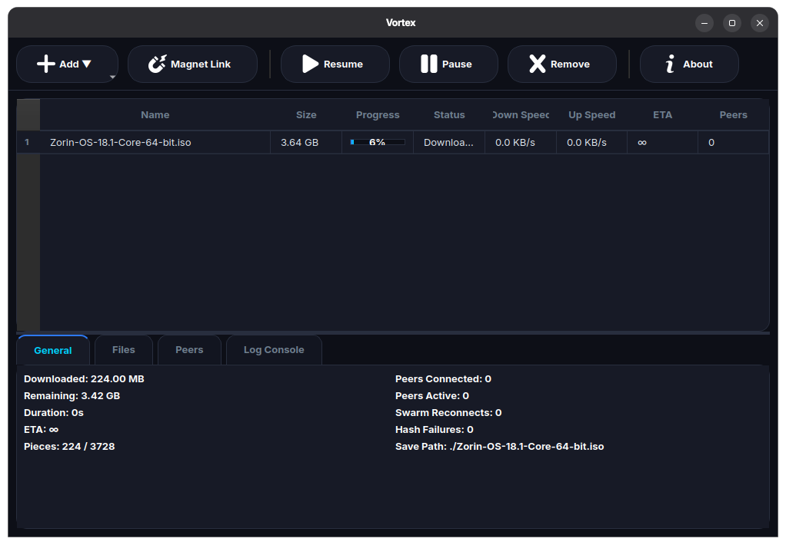
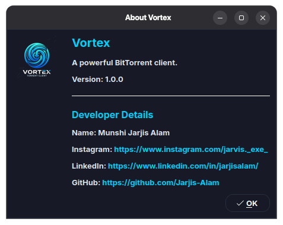

# Vortex

A modern BitTorrent client built entirely from scratch in Python.

Vortex implements the BitTorrent protocol from the ground up, including tracker communication, peer discovery, piece scheduling, SHA-1 verification, resume support, rarest-first piece selection, endgame mode, and multi-peer downloading — all wrapped in a clean PyQt6 desktop interface.

---

## Screenshot




---

## Features

### Core BitTorrent Protocol

* UDP Tracker Communication
* Peer Discovery
* BitTorrent Handshake
* Bitfield Processing
* Interested / Unchoke Flow
* Block Requests & Piece Assembly

### Download Engine

* Multi-Peer Downloading
* Rarest-First Piece Selection
* Endgame Mode
* SHA-1 Piece Verification
* Resume Support
* Automatic Peer Recovery
* Real-Time Download Statistics

### Desktop Application

* Modern PyQt6 Interface
* Torrent Management Dashboard
* Progress Tracking
* Download Speed Monitoring
* ETA Calculation
* Download History

---

## Technical Highlights

* Built from scratch without using existing torrent libraries
* Custom UDP Tracker Client
* Custom Peer Wire Protocol Implementation
* Concurrent Piece Downloading
* Hash-Based Integrity Verification
* Resume & Recovery System
* Cross-Platform Architecture

---

## Project Architecture

```text
Vortex
│
├── Tracker Client
│   ├── UDP Tracker Communication
│   └── Peer Discovery
│
├── Peer Engine
│   ├── Handshake
│   ├── Bitfield Processing
│   ├── Message Exchange
│   └── Piece Requests
│
├── Download Manager
│   ├── Piece Scheduler
│   ├── Rarest First Selection
│   ├── Endgame Mode
│   └── Resume Support
│
└── GUI
    ├── Torrent Dashboard
    ├── Statistics
    └── Download Controls
```

---

## Installation

### Clone Repository

```bash
git clone https://github.com/Jarjis-Alam/Vortex.git
cd Vortex
```

### Install Dependencies

```bash
pip install -r requirements.txt
```

### Run

```bash
python3 main.py
```

---

## Performance

Current implementation supports:

* Multi-Peer Downloading
* Verified Piece Integrity
* Resume Support
* Large Torrent Downloads
* Real-Time Progress Tracking

Successfully tested on Linux with multi-gigabyte torrents.

---

## Technologies Used

* Python
* PyQt6
* Socket Programming
* Multithreading
* SHA-1 Hashing
* Git & GitHub

---

## Author

**Munshi Jarjis Alam**

Computer Science & Technology Student
Institute of Engineering and Management (IEM), Kolkata

---

## License

This project is licensed under the MIT License.
