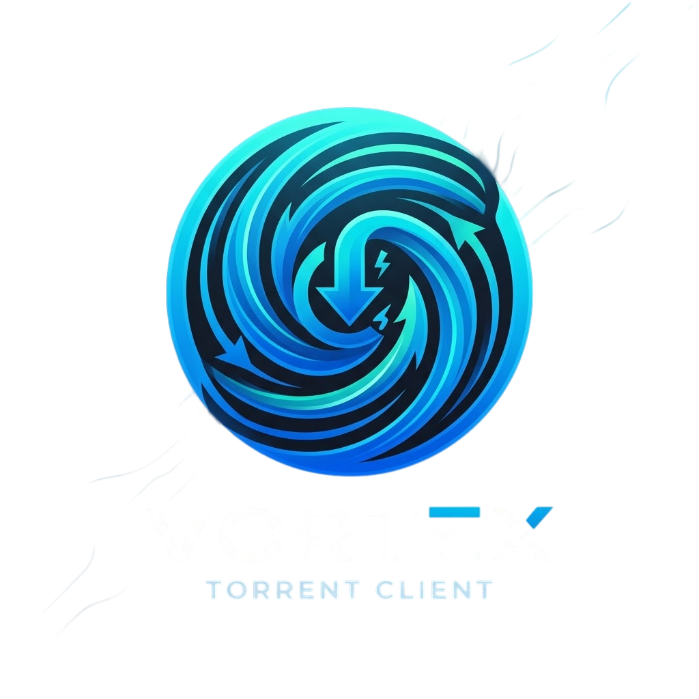
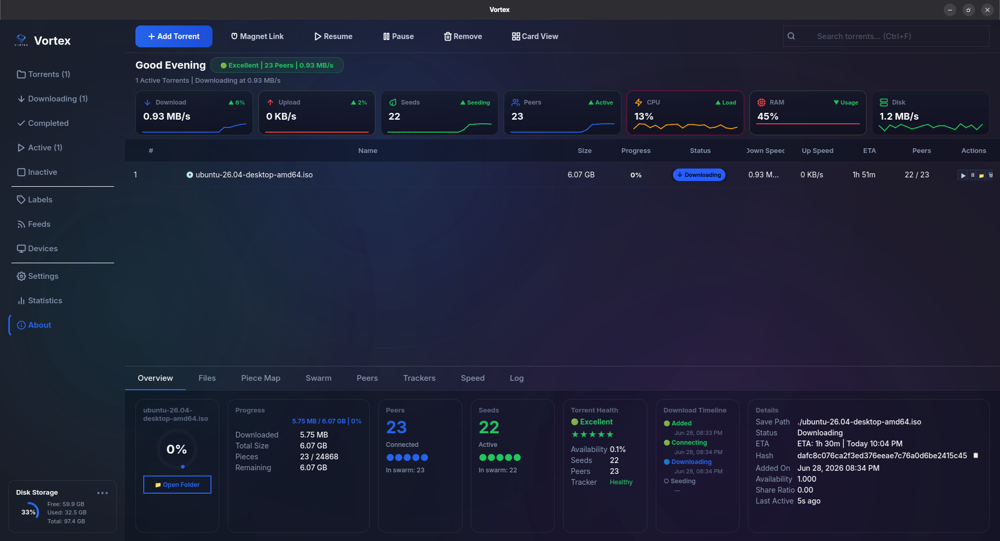
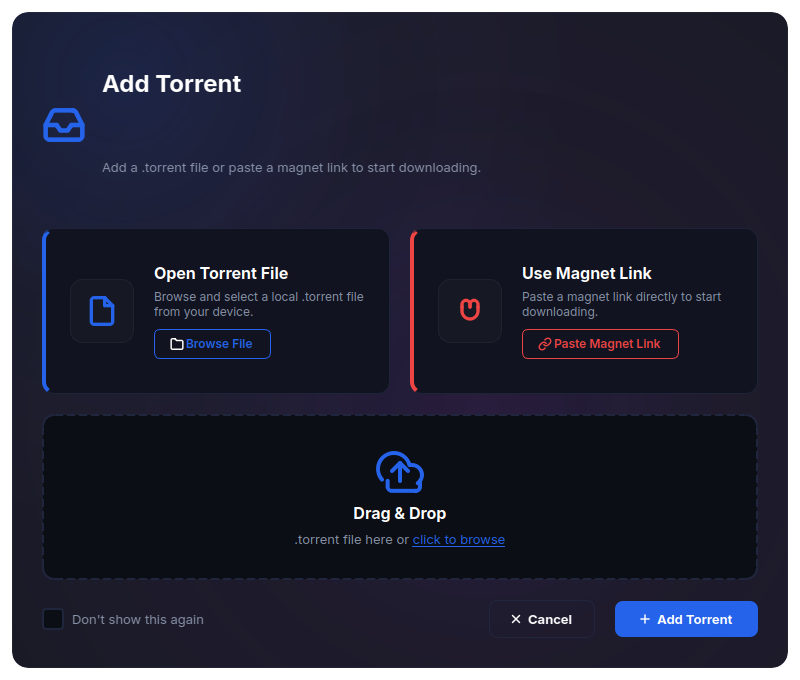
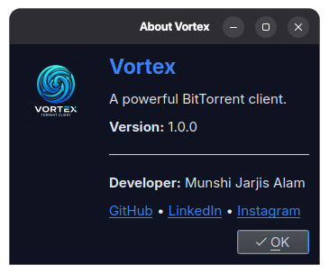

# <p align="center"><br>Vortex BitTorrent Client</p>

<p align="center">
  
  
  
  
  
</p>

Vortex is a modern, high-performance BitTorrent client implemented completely **from scratch in Python** and wrapped in a premium, dark-themed **PyQt6** desktop interface. 

Rather than wrapping existing libtorrent binaries, Vortex implements the entire BitTorrent Wire Protocol, piece assembly pipeline, and rarest-first scheduling algorithms from the ground up using raw sockets and multithreading.

---

## 📸 Screenshots

### Main Dashboard


### Settings & Configuration


### About Vortex & Session Details
<p align="center">
  
</p>

---

## ✨ Features

### ⚙️ Core Protocol Engine
* **UDP Tracker Client:** Complete implementation of the UDP tracker protocol (connect, announce, scrape) for rapid peer discovery.
* **Peer Wire Protocol:** Custom binary protocol parser handling handshakes, bitfield exchanges, choke/unchoke flows, and keep-alives.
* **Block & Piece Pipeline:** Intelligent chunk requesting (16KB blocks) with memory-efficient assembly and SHA-1 hashing verification.
* **Endgame Mode:** Speeds up the final percentages by requesting duplicate copies of missing blocks from multiple peers.

### 🚀 Download & Performance Manager
* **Multi-Peer Concurrency:** Parallelized worker-pool architecture downloading blocks from dozens of peers simultaneously.
* **Dynamic Rarest-First Scheduler:** Prioritizes download of pieces that are least available in the peer swarm, maximizing peer seed longevity.
* **Persistent Resume State:** Progress is autosaved dynamically so downloads resume exactly where they left off.
* **Bandwidth Throttling:** Built-in Token Bucket rate limiting to cap maximum download speed globally.

### 🎨 Desktop User Experience
* **Premium Dark Mode UI:** Modern custom QSS theme featuring clean glassmorphism, responsive hover states, and smooth layouts.
* **Advanced Visual Analytics:** High-fidelity custom statistics panels including a dynamic piece-distribution donut chart.
* **Comprehensive Metrics:** Real-time download speeds, peer health counts, ETA calculation, and progress bars.
* **Drag-and-Drop:** Drag `.torrent` files directly into the window to queue them for download.

---

## 🛠️ Installation & Usage

### Prerequisites
* **Python 3.8+**
* An internet connection (for peer discovery and downloads)

### Step 1: Clone the Repository
```bash
git clone https://github.com/Jarjis-Alam/Vortex.git
cd Vortex
```

### Step 2: Install Dependencies
It is highly recommended to run Vortex inside a virtual environment:
```bash
# Create and activate virtual environment
python3 -m venv venv
source venv/bin/activate  # On Windows: venv\Scripts\activate

# Install requirements
pip install -r requirements.txt
```

### Step 3: Run the Application
```bash
# Run GUI version (Default)
python main.py

# Run in headless CLI mode
python main.py --cli
```

---

## 📦 Building Standalone Executables

Vortex supports compilation into a standalone executable (no Python installation required) using a unified **PyInstaller** setup.

### Option A: Cloud Builds (GitHub Actions)
Whenever you push changes to GitHub, our CI/CD pipeline compiles Windows `.exe` and Linux binaries automatically.
1. Navigate to the **Actions** tab of your repository on GitHub.
2. Click the **Build Executables** workflow.
3. Click **Run workflow** or download completed artifacts from the bottom of the latest run page.

### Option B: Local Windows Build
If you are on a Windows machine:
1. Double-click the **`build_windows.bat`** script in the project root.
2. The script will set up a virtual environment, compile the application, and output the binaries to `dist\`.

### Option C: Local Linux Build
If you are on a Linux machine:
1. Run `./build_linux.sh` in your terminal.
2. The standalone binaries will be located in the `dist/` directory.

> [!NOTE]
> The build system outputs two targets:
> * **`Vortex` / `Vortex.exe`**: GUI application (No command console popup).
> * **`Vortex-CLI` / `Vortex-CLI.exe`**: Headless CLI application (Opens terminal console).

---

## 🏗️ Codebase Architecture

```text
Vortex/
├── .github/workflows/    # CI/CD pipelines (GitHub Actions)
├── assets/               # Screenshots and promotional assets
├── gui/                  # PyQt6 Desktop GUI components
│   ├── main_window.py    # Primary window and layout controller
│   ├── detail_panel.py   # Side panel displaying torrent metadata
│   ├── stats_bar.py      # Real-time statistics indicator
│   └── theme.py          # Dark theme styles and color tokens
├── resources/            # Image assets, logos, and icons
├── torrent.py            # .torrent file parsing & bencode decoder wrapper
├── tracker_client.py     # UDP Tracker client protocol parser
├── peer_pool.py          # Multi-peer connection and speed allocator
├── download_manager.py   # Worker threads, rare-first scheduler, rate limiting
└── main.py               # Main entry point (CLI/GUI router)
```

---

## 🎓 Author

* **Munshi Jarjis Alam**
  * Computer Science & Technology Student
  * Institute of Engineering and Management (IEM), Kolkata, India
  * [GitHub Profile](https://github.com/Jarjis-Alam)

---

## 📄 License

This project is licensed under the MIT License. See the [LICENSE](LICENSE) file for details.
